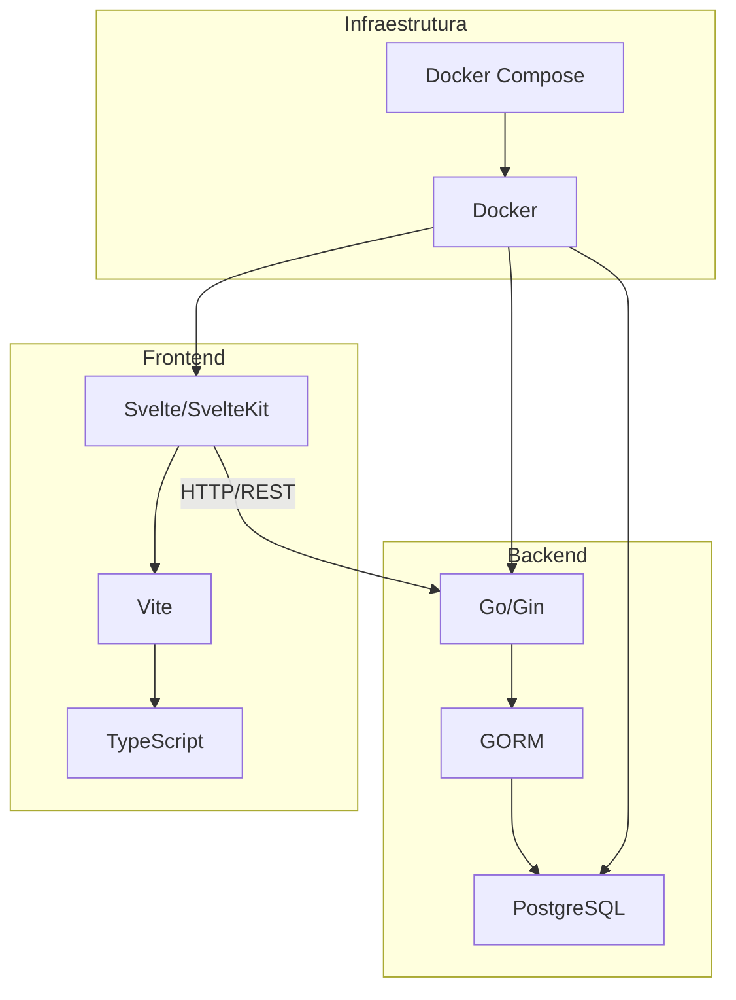

# SAVe - Sistema de Atendimento a Vítimas
## Documentação Técnica Completa

**Versão:** 1.1.0  
**Data:** 30/11/2025  
**Status:** Em Produção

---

## 📋 Sumário

1. [Visão Geral](#visão-geral)
2. [Arquitetura do Sistema](#arquitetura-do-sistema)
3. [Stack Tecnológico](#stack-tecnológico)
4. [Banco de Dados](#banco-de-dados)
5. [Backend](#backend)
6. [Frontend](#frontend)
7. [Docker e Deploy](#docker-e-deploy)
8. [Estrutura de Diretórios](#estrutura-de-diretórios)
9. [Funcionalidades](#funcionalidades)
10. [API Endpoints](#api-endpoints)
11. [Instalação e Configuração](#instalação-e-configuração)
12. [Desenvolvimento](#desenvolvimento)

---

## 🎯 Visão Geral

O **SAVe** é um sistema web para gerenciamento de atendimentos a vítimas de violência, desenvolvido para o Ministério Público. O sistema permite o registro, acompanhamento e encerramento de casos, com formulários detalhados divididos em múltiplas seções.

### Características Principais

- ✅ Gestão completa de casos de atendimento
- ✅ Formulários em duas versões: Breve e Completa
- ✅ Sistema de autenticação e autorização
- ✅ Arquivamento e reabertura de casos
- ✅ Interface responsiva e moderna
- ✅ Autosave automático em todas as seções
- ✅ Containerização com Docker

---

## 🏗️ Arquitetura do Sistema



### Padrão de Arquitetura

- **Frontend:** SPA (Single Page Application) com roteamento client-side
- **Backend:** API RESTful com arquitetura em camadas
- **Banco de Dados:** PostgreSQL com relacionamentos complexos
- **Comunicação:** HTTP/REST com JSON

---

## 💻 Stack Tecnológico

### Frontend

| Tecnologia | Versão | Propósito |
|------------|--------|-----------|
| **Svelte** | 4.x | Framework JavaScript reativo |
| **SvelteKit** | 1.x | Framework full-stack para Svelte |
| **TypeScript** | 5.x | Superset JavaScript com tipagem estática |
| **Vite** | 4.x | Build tool e dev server |
| **Axios** | 1.x | Cliente HTTP para chamadas API |
| **Tailwind CSS** | 3.x | Framework CSS utility-first |
| **Material Icons** | - | Biblioteca de ícones |

### Backend

| Tecnologia | Versão | Propósito |
|------------|--------|-----------|
| **Go** | 1.21+ | Linguagem de programação |
| **Gin** | 1.9+ | Framework web HTTP |
| **GORM** | 1.25+ | ORM para Go |
| **JWT-Go** | 3.2+ | Autenticação via tokens JWT |
| **godotenv** | 1.5+ | Gerenciamento de variáveis de ambiente |
| **bcrypt** | - | Hashing de senhas |

### Banco de Dados

| Tecnologia | Versão | Propósito |
|------------|--------|-----------|
| **PostgreSQL** | 15+ | Banco de dados relacional |

### DevOps

| Tecnologia | Versão | Propósito |
|------------|--------|-----------|
| **Docker** | 24+ | Containerização |
| **Docker Compose** | 2.x | Orquestração de containers |

---

## 🗄️ Banco de Dados

### Estrutura

O banco de dados `save_db` contém **23 tabelas** organizadas hierarquicamente:

#### Tabelas Principais

1. **SAVe_Geral** - Informações gerais do caso (1:1)
2. **SAVe_DadosDeEntrada** - Dados de entrada do caso (1:1)
3. **SAVe_Identificacao** - Identificação da vítima (1:1)
4. **SAVe_Identificacao_telefone** - Telefones (1:N)
5. **SAVe_Identificacao_email** - Emails (1:N)
6. **SAVe_Identificacao_endereco** - Endereços (1:N)
7. **SAVe_Situacao_Juridica** - Situação jurídica (1:1)
8. **SAVe_Situacao_Juridica2** - Processos judiciais (1:N)
9. **SAVe_Saude** - Informações de saúde (1:1)
10. **SAVe_Habitacao_Territorio** - Habitação e território (1:1)
11. **SAVe_Assistencia** - Assistência social (1:1)
12. **SAVe_Ensino_Trab_Renda** - Ensino, trabalho e renda (1:1)
13. **SAVe_Vinculos** - Vínculos familiares (1:N)
14. **SAVe_Vinculos_Apoio** - Rede de apoio (1:N)
15. **SAVe_Protecao_Seguranca** - Proteção e segurança (1:1)
16. **SAVe_Ameacadores** - Ameaçadores (1:N)
17. **SAVe_Adolescentes** - Adolescentes envolvidos (1:N)
18. **SAVe_Vitimizacao** - Vitimização (1:1)
19. **SAVe_Agressor** - Agressores (1:N) ⭐ NOVO
20. **SAVe_Encerramento** - Dados de encerramento (1:1)
21. **SAVe_Acompanhamentos** - Acompanhamentos (1:N)
22. **SAVe_Casos_Vinculados** - Casos vinculados (1:1)
23. **users** - Usuários do sistema

### Relacionamentos

- **1:1** - Uma linha por caso (ex: SAVe_Geral, SAVe_Identificacao)
- **1:N** - Múltiplas linhas por caso (ex: SAVe_Agressor, SAVe_Acompanhamentos)

### Chave Primária

- Tabelas 1:1: `ID_Caso` (PK)
- Tabelas 1:N: `ID` (PK auto-increment) + `ID_Caso` (FK)

### Configuração

```env
DB_HOST=localhost
DB_PORT=5432
DB_USER=postgres
DB_PASSWORD=86076448
DB_NAME=save_db
```

---

## 🔧 Backend

### Estrutura de Diretórios

```
backend/
├── cmd/
│   └── server/
│       └── main.go              # Entry point
├── internal/
│   ├── database/
│   │   └── database.go          # Conexão com DB
│   ├── handlers/
│   │   ├── auth.go              # Autenticação
│   │   ├── cases.go             # CRUD de casos
│   │   ├── archive.go           # Arquivamento
│   │   └── users.go             # Gestão de usuários
│   ├── middleware/
│   │   ├── auth.go              # JWT middleware
│   │   └── admin.go             # Admin middleware
│   └── models/
│       └── models.go            # Modelos GORM
├── .env                         # Variáveis de ambiente
├── Dockerfile                   # Container backend
└── go.mod                       # Dependências Go
```

### Principais Componentes

#### 1. Models (GORM)

Todos os modelos seguem a convenção GORM com tags JSON e GORM:

```go
type SAVe_Geral struct {
    ID_Caso    int    `gorm:"primaryKey;column:\"ID_Caso\"" json:"ID_Caso"`
    Nome       string `gorm:"column:\"Nome\"" json:"Nome"`
    Encerrado  string `gorm:"column:\"Encerrado\"" json:"Encerrado"`
    // ...
}
```

#### 2. Handlers

**Autenticação:**
- `POST /api/login` - Login com JWT
- `POST /api/change-password` - Alterar senha

**Casos:**
- `GET /api/cases` - Listar todos os casos
- `POST /api/cases` - Criar novo caso
- `GET /api/cases/:id` - Buscar caso por ID
- `DELETE /api/cases/:id` - Deletar caso
- `PUT /api/cases/:id/archive` - Arquivar caso ⭐ NOVO
- `PUT /api/cases/:id/reopen` - Reabrir caso ⭐ NOVO
- `PUT /api/cases/:id/:section` - Atualizar seção específica

**Usuários (Admin):**
- `GET /api/admin/users` - Listar usuários
- `POST /api/admin/users` - Criar usuário
- `PUT /api/admin/users/:id` - Atualizar usuário
- `DELETE /api/admin/users/:id` - Deletar usuário

#### 3. Middleware

**AuthMiddleware:**
- Valida token JWT
- Extrai informações do usuário
- Protege rotas autenticadas

**AdminMiddleware:**
- Verifica se usuário é admin
- Protege rotas administrativas

#### 4. Seções Suportadas

O endpoint `PUT /api/cases/:id/:section` suporta:

- `dados-entrada`
- `identificacao`
- `situacao-juridica`
- `saude`
- `habitacao-territorio`
- `assistencia`
- `ensino-trab-renda`
- `vinculos`
- `acompanhamentos`
- `protecao-seguranca`
- `vitimizacao`
- `agressor` ⭐ NOVO
- `encerramento` ⭐ NOVO

### Autenticação

**Fluxo:**
1. Login com username/password
2. Backend valida credenciais
3. Retorna JWT token
4. Frontend armazena token no localStorage
5. Token enviado em todas as requisições via header `Authorization: Bearer <token>`

---

## 🎨 Frontend

### Estrutura de Diretórios

```
frontend/
├── src/
│   ├── components/
│   │   └── sections/
│   │       ├── DadosEntrada.svelte
│   │       ├── Identificacao.svelte
│   │       ├── SituacaoJuridica.svelte
│   │       ├── Saude.svelte
│   │       ├── Territorio.svelte
│   │       ├── Assistencia.svelte
│   │       ├── EnsinoTrabRenda.svelte
│   │       ├── Vinculos.svelte
│   │       ├── ProtecaoSeguranca.svelte
│   │       ├── Agressor.svelte
│   │       ├── Vitimizacao.svelte
│   │       ├── Acompanhamento.svelte
│   │       └── Encerramento.svelte
│   ├── lib/
│   │   └── api.ts                # Cliente Axios
│   ├── routes/
│   │   ├── Login.svelte          # Tela de login
│   │   ├── Dashboard.svelte      # Painel de casos
│   │   └── CaseDetail.svelte     # Detalhes do caso
│   ├── App.svelte                # Componente raiz
│   └── main.ts                   # Entry point
├── Dockerfile                    # Container frontend
├── package.json                  # Dependências npm
├── tailwind.config.js            # Configuração Tailwind
├── tsconfig.json                 # Configuração TypeScript
└── vite.config.ts                # Configuração Vite
```

### Componentes Principais

#### 1. Login.svelte

- Formulário de autenticação
- Validação de credenciais
- Armazenamento de token JWT
- Redirecionamento pós-login

#### 2. Dashboard.svelte

**Funcionalidades:**
- Listagem de casos em tabela
- Ordenação por colunas (ID, Nome, Data, etc.)
- Busca por ID, Nome ou Número de Processo
- Checkbox "Mostrar casos Arquivados"
- **Casos arquivados com fundo cinza escuro (`bg-gray-300`)** ⭐ NOVO
- Botão "Novo Caso" com seleção de tipo (Breve/Completo)

#### 3. CaseDetail.svelte

**Funcionalidades:**
- Navegação por abas entre seções
- Alternância entre Versão Breve/Completa
- **Botão "Reabrir Caso" na barra superior** (visível apenas se `Encerrado = "Sim"`) ⭐ NOVO
- Carregamento dinâmico de componentes
- Barra superior com informações do caso

#### 4. Componentes de Seção

Cada seção segue o padrão:
- **Props:** `caseId` (número do caso)
- **Autosave:** Salva automaticamente após 1 segundo de inatividade
- **Manual Save:** Botão "Salvar" para salvamento manual
- **Loading State:** Indicador de carregamento
- **Error Handling:** Tratamento de erros com feedback visual

### Roteamento

```typescript
/                    → Login
/dashboard           → Dashboard (lista de casos)
/case/:id            → CaseDetail (detalhes do caso)
```

### API Client

```typescript
// lib/api.ts
import axios from 'axios';

const api = axios.create({
  baseURL: 'http://localhost:8080/api',
  headers: {
    'Content-Type': 'application/json',
  },
});

// Interceptor para adicionar token JWT
api.interceptors.request.use((config) => {
  const token = localStorage.getItem('token');
  if (token) {
    config.headers.Authorization = `Bearer ${token}`;
  }
  return config;
});
```

### Estilização

**Tailwind CSS:**
- Utility-first CSS framework
- Classes customizadas em `tailwind.config.js`
- Cores principais: `save-primary`, `save-secondary`, `save-accent`

**Material Icons:**
- Ícones do Google Material Design
- Uso: `<span class="material-icons">icon_name</span>`

---

## 🐳 Docker e Deploy

### Arquitetura de Containers

```yaml
# docker-compose.yml
services:
  frontend:
    build: ./frontend
    ports:
      - "3001:3001"
    depends_on:
      - backend
  
  backend:
    build: ./backend
    ports:
      - "8080:8080"
    environment:
      - DB_HOST=db
      - DB_PORT=5432
      - DB_USER=postgres
      - DB_PASSWORD=86076448
      - DB_NAME=save_db
    depends_on:
      - db
  
  db:
    image: postgres:15
    environment:
      - POSTGRES_USER=postgres
      - POSTGRES_PASSWORD=86076448
      - POSTGRES_DB=save_db
    volumes:
      - postgres_data:/var/lib/postgresql/data
    ports:
      - "5432:5432"

volumes:
  postgres_data:
```

### Dockerfiles

**Frontend:**
```dockerfile
FROM node:18-alpine
WORKDIR /app
COPY package*.json ./
RUN npm install
COPY . .
EXPOSE 3001
CMD ["npm", "run", "dev", "--", "--host", "0.0.0.0", "--port", "3001"]
```

**Backend:**
```dockerfile
FROM golang:1.21-alpine
WORKDIR /app
COPY go.mod go.sum ./
RUN go mod download
COPY . .
RUN go build -o main cmd/server/main.go
EXPOSE 8080
CMD ["./main"]
```

### Comandos Docker

```bash
# Iniciar todos os serviços
docker-compose up -d

# Ver logs
docker-compose logs -f

# Parar serviços
docker-compose down

# Rebuild containers
docker-compose up --build
```

---

## 📁 Estrutura de Diretórios Completa

```
SAVe_New/
├── backend/
│   ├── cmd/
│   │   └── server/
│   │       └── main.go
│   ├── internal/
│   │   ├── database/
│   │   │   └── database.go
│   │   ├── handlers/
│   │   │   ├── auth.go
│   │   │   ├── cases.go
│   │   │   ├── archive.go          ⭐ NOVO
│   │   │   └── users.go
│   │   ├── middleware/
│   │   │   ├── auth.go
│   │   │   └── admin.go
│   │   └── models/
│   │       └── models.go
│   ├── .env
│   ├── Dockerfile
│   ├── go.mod
│   └── go.sum
├── frontend/
│   ├── src/
│   │   ├── components/
│   │   │   └── sections/
│   │   ├── lib/
│   │   │   └── api.ts
│   │   ├── routes/
│   │   │   ├── Login.svelte
│   │   │   ├── Dashboard.svelte
│   │   │   └── CaseDetail.svelte
│   │   ├── App.svelte
│   │   └── main.ts
│   ├── Dockerfile
│   ├── package.json
│   ├── tailwind.config.js
│   ├── tsconfig.json
│   └── vite.config.ts
├── docker-compose.yml
├── CHANGELOG_ENDPOINTS.md
├── DOCUMENTACAO_COMPLETA.md        ⭐ ESTE ARQUIVO
└── README.md
```

---

## ⚙️ Funcionalidades

### 1. Gestão de Casos

#### Criar Caso
- Seleção de tipo (Breve/Completo)
- Criação automática de registro em `SAVe_Geral`
- Redirecionamento para tela de edição

#### Editar Caso
- 13 seções editáveis
- Autosave automático (1s após inatividade)
- Salvamento manual via botão
- Feedback visual de status

#### Arquivar Caso ⭐ NOVO
- Botão "Encerrar Caso" na seção Encerramento
- Atualiza `Encerrado = "Sim"` em `SAVe_Geral`
- Salva dados de encerramento
- Redireciona para Dashboard após 2 segundos

#### Reabrir Caso ⭐ NOVO
- Botão "Reabrir Caso" na barra superior (visível apenas se arquivado)
- Atualiza `Encerrado = "Não"`
- Recarrega página automaticamente
- Disponível em todas as abas do caso

#### Deletar Caso
- Botão de exclusão no Dashboard
- Confirmação obrigatória
- Deleta em cascata todos os dados relacionados

### 2. Filtros e Busca

**Dashboard:**
- Busca por ID, Nome ou Número de Processo
- Checkbox "Mostrar casos Arquivados"
- Ordenação por colunas (clique no cabeçalho)
- **Casos arquivados com fundo cinza escuro (`bg-gray-300`)** ⭐ NOVO

### 3. Autenticação e Autorização

**Níveis de Acesso:**
- **Usuário:** Acesso a casos e edição
- **Admin:** Acesso total + gestão de usuários

**Rotas Protegidas:**
- Todas as rotas exceto `/login` requerem autenticação
- Rotas `/admin/*` requerem privilégios de admin

### 4. Versões de Formulário

**Versão Breve:**
- Dados de Entrada
- Identificação
- Situação Jurídica
- Proteção e Segurança
- Vitimização

**Versão Completa:**
- Todas as 13 seções disponíveis

---

## 🔌 API Endpoints

### Autenticação

```http
POST /api/login
Content-Type: application/json

{
  "username": "string",
  "password": "string"
}

Response: {
  "token": "jwt_token",
  "user": {
    "id": 1,
    "username": "string",
    "role": "admin|user"
  }
}
```

### Casos

```http
# Listar casos
GET /api/cases
Authorization: Bearer <token>

# Criar caso
POST /api/cases
Authorization: Bearer <token>
Content-Type: application/json

{
  "Tipo_Form": "Breve|Completo"
}

# Buscar caso
GET /api/cases/:id
Authorization: Bearer <token>

# Atualizar seção
PUT /api/cases/:id/:section
Authorization: Bearer <token>
Content-Type: application/json

{
  // Dados específicos da seção
}

# ⭐ NOVO: Arquivar caso
PUT /api/cases/:id/archive
Authorization: Bearer <token>
Content-Type: application/json

{
  "Data_Encerramento": "2025-11-30",
  "Forma_Encerramento": "Alta",
  "Observacao": "string",
  "Encaminhamento_Pos_Alta": "string"
}

# ⭐ NOVO: Reabrir caso
PUT /api/cases/:id/reopen
Authorization: Bearer <token>

# Deletar caso
DELETE /api/cases/:id
Authorization: Bearer <token>
```

### Usuários (Admin)

```http
# Listar usuários
GET /api/admin/users
Authorization: Bearer <admin_token>

# Criar usuário
POST /api/admin/users
Authorization: Bearer <admin_token>
Content-Type: application/json

{
  "username": "string",
  "password": "string",
  "role": "admin|user"
}

# Atualizar usuário
PUT /api/admin/users/:id
Authorization: Bearer <admin_token>

# Deletar usuário
DELETE /api/admin/users/:id
Authorization: Bearer <admin_token>
```

---

## 🚀 Instalação e Configuração

### Pré-requisitos

- **Node.js** 18+
- **Go** 1.21+
- **PostgreSQL** 15+
- **Docker** 24+ (opcional)
- **Docker Compose** 2+ (opcional)

### Instalação Local

#### 1. Clonar Repositório

```bash
cd "c:\Users\User\Desktop\SAVe_Svelt e GoLang\Tabelas SAVe\SAVe_New"
```

#### 2. Configurar Banco de Dados

```bash
# Criar banco de dados
psql -U postgres
CREATE DATABASE save_db;
\q

# Executar migrations
psql -U postgres -d save_db -f database/schema.sql

# ⭐ NOVO: Criar tabela SAVe_Agressor
psql -U postgres -d save_db -f backend/create_agressor_table.sql
```

#### 3. Configurar Backend

```bash
cd backend

# Criar arquivo .env
echo "DB_HOST=localhost" > .env
echo "DB_PORT=5432" >> .env
echo "DB_USER=postgres" >> .env
echo "DB_PASSWORD=86076448" >> .env
echo "DB_NAME=save_db" >> .env
echo "PORT=8080" >> .env
echo "JWT_SECRET=your_secret_key_here" >> .env

# Instalar dependências
go mod download

# Executar
go run cmd/server/main.go
```

#### 4. Configurar Frontend

```bash
cd frontend

# Instalar dependências
npm install

# Executar em desenvolvimento
npm run dev
```

### Instalação com Docker

```bash
# Iniciar todos os serviços
docker-compose up -d

# Verificar status
docker-compose ps

# Ver logs
docker-compose logs -f
```

### Acessar Aplicação

- **Frontend:** http://localhost:3001
- **Backend:** http://localhost:8080
- **PostgreSQL:** localhost:5432

### Credenciais Padrão

```
Username: admin
Password: admin123
```

---

## 👨‍💻 Desenvolvimento

### Comandos Úteis

**Frontend:**
```bash
npm run dev          # Servidor de desenvolvimento
npm run build        # Build para produção
npm run preview      # Preview do build
```

**Backend:**
```bash
go run cmd/server/main.go           # Executar servidor
go build -o main cmd/server/main.go # Build
go test ./...                       # Testes
```

### Estrutura de Desenvolvimento

1. **Criar nova seção:**
   - Adicionar modelo em `backend/internal/models/models.go`
   - Criar handler em `backend/internal/handlers/cases.go`
   - Criar componente em `frontend/src/components/sections/`
   - Registrar em `CaseDetail.svelte`

2. **Adicionar endpoint:**
   - Criar handler em `backend/internal/handlers/`
   - Registrar rota em `backend/cmd/server/main.go`
   - Criar chamada API em frontend

3. **Modificar banco de dados:**
   - Atualizar modelo GORM
   - Criar migration SQL
   - Executar migration no banco

### Boas Práticas

- ✅ Sempre usar autosave + manual save
- ✅ Validar dados no frontend e backend
- ✅ Usar transações para operações complexas
- ✅ Tratar erros com feedback visual
- ✅ Manter código DRY (Don't Repeat Yourself)
- ✅ Documentar mudanças significativas

---

## 📝 Changelog

Ver [CHANGELOG_ENDPOINTS.md](file:///c:/Users/User/Desktop/SAVe_Svelt%20e%20GoLang/Tabelas%20SAVe/SAVe_New/CHANGELOG_ENDPOINTS.md) para histórico detalhado de mudanças.

### Últimas Atualizações (v1.1.0)

- ✅ Sistema de arquivamento de casos
- ✅ Botão "Reabrir Caso" na barra superior
- ✅ Endpoint `/archive` e `/reopen`
- ✅ Tabela `SAVe_Agressor` criada
- ✅ Endpoints para agressor, encerramento e acompanhamentos
- ✅ Casos arquivados com fundo cinza no Dashboard
- ✅ Campo `Encaminhamento_Pos_Alta` em Encerramento

---

## 📞 Suporte

Para dúvidas ou problemas, consulte:
- Documentação técnica (este arquivo)
- Changelog de endpoints
- Logs do sistema (`backend_debug_territorio.log`)

---

**Desenvolvido para o Ministério Público**  
**Versão 1.1.0 - Novembro 2025**
